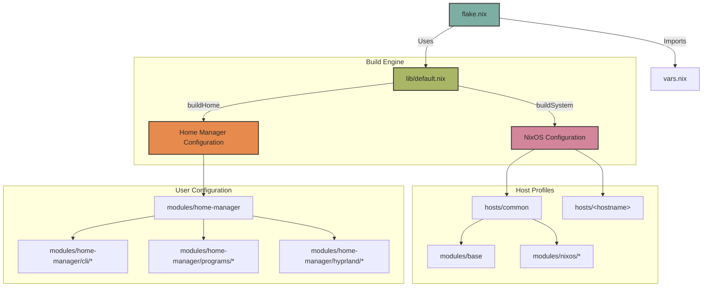

# ❄️ thiagokimo's NixOS & Home Manager Configuration

<div align="center">

[](https://nixos.org)
[](https://hyprland.org)
[](https://github.com/nix-community/nixvim)
[](https://github.com/nix-community/stylix)
[](LICENSE)

*A premium, modular, and beautiful multi-host system configuration powered by **Nix Flakes**, customized around a unified **Gruvbox Dark Hard** aesthetics, a high-performance **Hyprland** Lua environment, and fully declarative workflows.*

---

[Key Features](#-key-features) • [Screenshots](#-screenshots) • [Architecture](#%EF%B8%8F-architecture) • [Hosts](#-hosts) • [Quick Start](#-quick-start)

</div>

---

## ✨ Key Features

- **📂 Modular Design**: Separation of system (`modules/nixos`), user space (`modules/home-manager`), custom binaries (`pkgs`), and host definitions (`hosts/`).
- **🎛️ Multi-Host Support**: Ready for standard x86 systems (Framework & ThinkPad T14), ARM64 hardware (ThinkPad X13s), and lightweight standalone Chromebook home-manager setups (`penguin`).
- **🎨 Unified Aesthetics (Stylix)**: System-wide **Gruvbox Dark Hard** color palette applied to applications, cursor (`Bibata-Modern-Ice`), fonts (`JetBrainsMono Nerd Font`), and styling via a centralized wallpapers repository (`thiagokimo/nix-wallpapers`).
- **🌀 Lua-Powered Hyprland**: Integrates `noctalia-shell` to compile a custom, modular `hyprland.lua` bind/control sheet for advanced screen locker, workspace rules, and hardware bindings.
- **⚡ Nixvim Editor**: A fully declarative Neovim environment customized with `neotree`, `lualine`, `bufferline`, `vim-nix`, and Dart coding plugins.

---

## 📸 Screenshots

<div align="center">

### 🌌 Desktop Workspace

*Hyprland active workspace showing the custom Waybar, Gruvbox theme, and high-performance blur aesthetics.*

---

### 💻 Developer Environment

*Kitty terminal executing Zsh and Yazi file manager alongside the declarative Nixvim editor.*

---

### 🔍 App Launcher & Interface

*The elegant Noctalia App Launcher toggled in action.*

</div>

---

## 🏗️ Architecture

This repository uses a sophisticated, custom Nix Flake layout to build NixOS configurations and Home-Manager environments dynamically, using a shared library helper (`lib/default.nix`).

### System Component Diagram



### Directory Structure

```text
.
├── flake.lock
├── flake.nix                  # Flake entry point & target host declarations
├── vars.nix                   # Global variables (username, email, themes, etc.)
├── assets/                    # Screenshots and assets
├── hosts/                     # Machine-specific configurations
│   ├── common/                # Shared base configurations across machines
│   ├── framework/             # Intel Framework 13 Laptop configuration
│   ├── t14/                   # Lenovo ThinkPad T14 Laptop configuration
│   ├── x13s/                  # Lenovo ThinkPad X13s ARM Laptop configuration
│   └── penguin/               # Standalone Chromebook / Crostini config
├── lib/                       # Custom library helper functions for building systems
├── modules/                   # Reusable configuration modules
│   ├── base/                  # Core system optimizations, GC, user configurations
│   ├── nixos/                 # Global NixOS components (Audio, Boot, Fonts, Steam)
│   └── home-manager/          # User-space configurations (Stylix, XDG, Cli, Programs)
│       ├── cli/               # Shell config (Zsh, Fzf, Eza, Yazi, Nixvim)
│       ├── hyprland/          # Custom Lua Hyprland & Hyprpaper setup
│       └── programs/          # GUI apps (Kitty, Dunst, Waybar, Wofi, Noctalia)
├── overlays/                  # Nixpkgs overlays (stable packages, custom changes)
└── pkgs/                      # Custom local packages definitions
```

---

## 🖥️ Hosts

| Hostname | Architecture | Target Platform | Type | Purpose / Description |
| :--- | :--- | :--- | :--- | :--- |
| **`framework`** | `x86_64-linux` | Framework Laptop | NixOS | Primary development machine |
| **`t14`** | `x86_64-linux` | ThinkPad T14 | NixOS | Secondary portable workstation |
| **`x13s`** | `aarch64-linux` | ThinkPad X13s | Home-Manager | High efficiency Snapdragon ARM64 setup |
| **`penguin`** | `x86_64-linux` | Chromebook / Crostini | Home-Manager | Independent standalone dotfile setup |

---

## 🚀 Quick Start

### 1. Clone the repository
```bash
git clone https://github.com/thiagokimo/nix-config.git ~/.config/nix-config
cd ~/.config/nix-config
```

### 2. Validate configuration
Ensure everything evaluates perfectly before building:
```bash
nix flake check
```

### 3. Apply NixOS system changes
Apply the host settings (substitute `<hostname>` with `framework` or `t14`):
```bash
sudo nixos-rebuild switch --flake .#<hostname>
```

### 4. Apply User settings (Home Manager)
Apply the standalone home-manager profile:
```bash
home-manager switch --flake .#thiago@<hostname>
```

---

<div align="center">

*Configured with ❄️ and 💚 by [thiagokimo](https://github.com/thiagokimo)*

</div>
