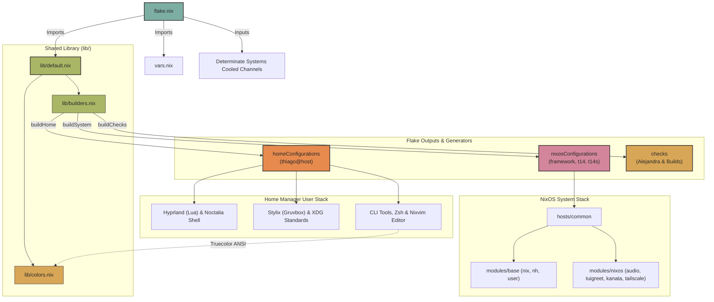

# ❄️ thiagokimo's NixOS & Home Manager Configuration

<div align="center">

[](https://nixos.org)
[-4bbaea.svg?logo=hyprland&logoColor=white&style=for-the-badge)](https://hyprland.org)
[](https://github.com/noctalia-dev/noctalia-shell)
[](https://github.com/nix-community/nixvim)
[-ff69b4.svg?style=for-the-badge)](https://github.com/nix-community/stylix)
[-d3869b.svg?style=for-the-badge)](https://github.com/viperML/nh)
[](LICENSE)

*A robust, modular, and aesthetic multi-host workstation setup managed through **Nix Flakes**, featuring **Determinate Systems cooled channels**, a unified **Gruvbox Dark Hard** palette, a Lua-compiled **Hyprland** desktop powered by **Noctalia Shell**, declarative **Nixvim**, low-latency **Kanata** dual-role keys, and **nh** workflow automation.*

---

[Key Features](#-key-features) • [Screenshots](#-screenshots) • [Architecture & Flake Design](#%EF%B8%8F-architecture--flake-design) • [Hardware & Hosts](#-hardware--hosts) • [Desktop & Noctalia Shell](#-desktop--noctalia-shell) • [System Services & Base](#%EF%B8%8F-system-services--base) • [CLI, Nixvim & User Space](#-cli-nixvim--user-space) • [Modular Options System (`custom.*`)](#-modular-options-system-custom) • [Directory Layout](#-directory-layout)

</div>

---

## ✨ Key Features

- **❄️ Determinate Systems Cooldown Channels**: Tracks Determinate Systems weekly cooled unstable (`nixpkgs-weekly`) for stability while pulling tested dependencies from the chilled channel (`nixpkgs-26.05-chilled`).
- **🎛️ Multi-Host Hardware Profiles**:
  - **Framework 13 (AMD)**: Full hardware acceleration, LUKS disk encryption, high-DPI scaling (2256×1504 display).
  - **ThinkPad T14 Gen 2 (Intel)**: Curated `nixos-hardware` profile, LUKS disk encryption, and 8GB swapfile.
  - **ThinkPad T14s (Intel)**: Curated `nixos-hardware` profile, LUKS disk encryption, and 8GB swapfile.
- **🎨 System-Wide Gruvbox Aesthetics (Stylix)**: System and user-space synchronization under **Gruvbox Dark Hard** base16 palette, paired with **Bibata-Modern-Ice** cursors, **JetBrainsMono Nerd Font**, and centralized wallpapers fetched from `thiagokimo/nix-wallpapers`.
- **🌀 Lua-Compiled Hyprland Desktop**: Wayland compositor configured dynamically through a compiled `hyprland.lua` configuration, including custom Bezier animations, dwindle layout, and hardware/media shortcuts.
- **🌖 Noctalia Shell Ecosystem**: Modern unified status bar and desktop shell delivering split dual bars (top and bottom), Belo Horizonte live weather tracking, media control, audio visualizers, and a **display-resolution-aware lockscreen** whose widget geometry calculates mathematically per host.
- **⚡ Fully Declarative Nixvim**: Complete Neovim environment maintained declaratively in Nix with `lualine`, `neo-tree`, `bufferline`, `vim-nix`, `dart-vim-plugin`, and `stylua`.
- **⌨️ Low-Latency Dual-Role Keys (Kanata)**: Hardware-level keyboard remap daemon intercepting `uinput` to provide tap-for-Escape and hold-for-Ctrl on both Caps Lock and Left Control (`(tap-hold 100 200 esc lctrl)`).
- **🚀 nh (Nix CLI Helper) & Automated GC**: Integrated `nh` for accelerated switching (`nrs` and `hms` aliases) alongside automated weekly Nix store optimization and garbage collection (`--delete-older-than 7d`).
- **🌐 Secure Mesh Networking (Tailscale)**: Kernel-level Tailscale service with trusted interface routing (`tailscale0`) and loose reverse-path filtering.

---

## 📸 Screenshots

<div align="center">

### 🌌 Desktop Workspace

*Hyprland active workspace with Noctalia Shell dual bars, Gruvbox theme, and smooth blur styling.*

---

### 💻 Developer Environment

*Kitty terminal executing Zsh, Fastfetch with dynamic Stylix ANSI cards, Yazi file manager, and declarative Nixvim.*

---

### 🔍 App Launcher & Interface

*The Noctalia App Launcher toggled in action.*

</div>

---

## 🏗️ Architecture & Flake Design

The repository centers around a declarative, modular Nix Flake layout that dynamically generates NixOS configurations, Home Manager profiles, and test checks via a centralized library helper (`lib/default.nix`).

### System Architecture Diagram


```mermaid
graph TD
    Flake["flake.nix"] -->|Imports| Vars["vars.nix"]
    Flake -->|Imports| Lib["lib/default.nix"]
    Flake -->|Inputs| DetSys["Determinate Systems Cooled Channels"]

    subgraph CustomLib ["Shared Library (lib/)"]
        Lib --> Builders["lib/builders.nix"]
        Lib --> Colors["lib/colors.nix"]
    end

    subgraph Generators ["Flake Outputs & Generators"]
        Builders -->|buildSystem| NixOS["nixosConfigurations<br/>(framework, t14, t14s)"]
        Builders -->|buildHome| HomeM["homeConfigurations<br/>(thiago@host)"]
        Builders -->|buildChecks| Checks["checks<br/>(Alejandra & Builds)"]
    end

    subgraph NixOSStack ["NixOS System Stack"]
        NixOS --> Common["hosts/common"]
        Common --> Base["modules/base (nix, nh, user)"]
        Common --> Services["modules/nixos (audio, tuigreet, kanata, tailscale)"]
    end

    subgraph HMStack ["Home Manager User Stack"]
        HomeM --> Desktop["Hyprland (Lua) & Noctalia Shell"]
        HomeM --> Theming["Stylix (Gruvbox) & XDG Standards"]
        HomeM --> CLI["CLI Tools, Zsh & Nixvim Editor"]
        CLI -.->|Truecolor ANSI| Colors
    end

    style Flake fill:#7daea3,stroke:#3c3836,stroke-width:2px,color:#282828
    style Lib fill:#a9b665,stroke:#3c3836,stroke-width:2px,color:#282828
    style Builders fill:#a9b665,stroke:#3c3836,stroke-width:1px,color:#282828
    style Colors fill:#d8a657,stroke:#3c3836,stroke-width:1px,color:#282828
    style NixOS fill:#d3869b,stroke:#3c3836,stroke-width:2px,color:#282828
    style HomeM fill:#e78a4e,stroke:#3c3836,stroke-width:2px,color:#282828
    style Checks fill:#d8a657,stroke:#3c3836,stroke-width:2px,color:#282828
```

### Shared Library Utilities (`lib/`)

System generation, testing, and theme calculations are abstracted into modular library helpers:

- **`myLib.buildSystem`**: Generates a standard `nixosSystem` evaluated against the selected host platform, injecting `inputs`, `user`, `hostname`, `vars`, and `myLib` into module `specialArgs`.
- **`myLib.buildHome`**: Generates a standalone `homeManagerConfiguration` mapped to `modules/home-manager`, injecting identical context into `extraSpecialArgs`.
- **`myLib.buildChecks`**: Dynamically generates CI and evaluation checks for the host architecture:
  - **Formatting**: Validates repository Nix formatting against `alejandra`.
  - **NixOS Toplevel Builds**: Verifies evaluation and builds the system toplevel for each declared host in `vars.hosts`.
  - **Home Manager Activations**: Validates and builds user activation packages for each declared host.
- **`myLib.colors` (`lib/colors.nix`)**: Exposes `hexToDec` and `hexToRgb` functions. Used across modules (such as `modules/home-manager/cli/fastfetch.nix`) to translate Stylix hex color definitions into RGB ANSI escape codes dynamically.

### Package Channels & Overlays

1. **Determinate Systems Weekly (`nixpkgs`)**: High-velocity unstable channel curated and cooled weekly to eliminate broken upstream builds.
2. **Determinate Systems Chilled (`nixpkgs-stable`)**: Pinned stable release channel exposed via the `pkgs.stable` overlay (`overlays/default.nix`).
3. **OpenLDAP Patch Overlay**: Overrides `openldap` package attributes to bypass test suites (`doCheck = false`, `doInstallCheck = false`) for faster, non-blocking builds.
4. **Developer Shell (`devShells.default`)**: Preconfigured environment packing `alejandra` (formatter), `nixd` (Nix language server), and `antigravity-ide`.

---

## 🖥️ Hardware & Hosts

Host configurations reside under `hosts/` and are registered centrally in `vars.hosts`:

| Hostname | Platform / CPU | Target Machine | Resolution | Storage / Swap | Special Hardware Configurations |
| :--- | :--- | :--- | :--- | :--- | :--- |
| **`framework`** | `x86_64-linux`<br>AMD Ryzen | Framework Laptop 13 | `2256×1504`<br>(eDP-1) | LUKS Encrypted<br>Swap Partition | `hardware.cpu.amd.updateMicrocode`, AMD KVM virtualization, high-DPI scaling. |
| **`t14`** | `x86_64-linux`<br>Intel Gen 2 | Lenovo ThinkPad T14 | `1920×1080`<br>(eDP-1) | LUKS Encrypted<br>8GB `/swapfile` | `nixos-hardware` T14 module, Intel microcode, power-profiles-daemon. |
| **`t14s`** | `x86_64-linux`<br>Intel | Lenovo ThinkPad T14s | `1920×1080`<br>(eDP-1) | LUKS Encrypted<br>8GB `/swapfile` | `nixos-hardware` T14s module, Intel microcode, power-profiles-daemon. |

---

## 🌖 Desktop & Noctalia Shell

### Lua-Powered Hyprland (`modules/home-manager/hyprland`)

Rather than maintaining a flat configuration file, `modules/home-manager/hyprland/hyprland.nix` dynamically compiles `~/.config/hypr/hyprland.lua`:
- **Window Management & Dwindle**: Dwindle layout with smart splits, active window opacity `1.0`, inactive opacity `0.89`, border radius `20px`, and custom cubic-bezier animations (`myBezier, 0.05, 0.9, 0.1, 1.05`).
- **Window Rules**: Dedicated workspace pinning for Steam (workspace 7), Kew and Pavucontrol (workspace 9).
- **Noctalia IPC Integration**: Hyprland binds communicate directly with the Noctalia daemon via `${ipc} = "noctalia msg"`:
  - `SUPER + SPACE`: Toggle application launcher panel
  - `SUPER + SHIFT + L`: Lock screen
  - `SUPER + PRINT`: Fullscreen screenshot to `~/Media/Pictures/Screenshots`
  - `SUPER + SHIFT + PRINT`: Interactive region screenshot
  - Hardware keys: Audio mute, volume up/down, brightness up/down, and lid switch sleep/lock triggers.

### Noctalia Shell (`modules/home-manager/programs/noctalia`)

A unified desktop shell environment offering status bars, widgets, and lockscreen management:
- **Dual Status Bars**:
  - **Top Bar**: Workspace pager, taskbar, active window indicator, brightness slider, volume status, network status, battery level, and clock.
  - **Bottom Bar**: RAM usage, CPU temperature, system monitor, media controls, audio visualizer, system tray, notification center, clipboard history, Bluetooth manager, and session control.
- **Dynamic Lockscreen Widget Layout**:
  Lockscreen widget coordinates are computed mathematically based on the active host's screen dimensions (`vars.hosts.${hostname}.display`):
  - Dynamic center coordinates: `centerX = width / 2`, `centerY = height / 2`.
  - Clock anchored at `cy = height * 0.25`, Sysmon at `cx = width * 0.75`, Weather at `cx = width * 0.25`, audio visualizer centered, and login box anchored at `cy = height - 128`.
- **Live Weather & Localization**: Live weather integration targeting Belo Horizonte, displayed in Celsius with graphical ambient effects.

---

## ⚙️ System Services & Base

Shared system capabilities configured in `modules/base` and `modules/nixos`:

- **Low-Latency Kanata Daemon (`services/kanata.nix`)**:
  Interception service running under dedicated `uinput` permissions that turns both **Caps Lock** and **Left Control** into dual-role keys: tapping outputs `Escape` and holding outputs `Left Control` (`tap-hold 100 200 esc lctrl`).
- **Tuigreet Display Manager (`services/tuigreet.nix`)**:
  Clean TUI greeting display manager launching directly into `start-hyprland`.
- **Tailscale Mesh VPN (`services/tailscale.nix`)**:
  Enables Tailscale daemon with `tailscale0` set as a trusted firewall interface and `checkReversePath = "loose"` for exit-node and subnet compatibility.
- **PipeWire & WirePlumber (`audio.nix`)**:
  Full audio stack replacement with PipeWire, WirePlumber session management, 32-bit ALSA support, PulseAudio emulation (`pactl`), and JACK integration.
- **Containerization & Gaming**:
  - Docker daemon with `docker-compose` and non-root group assignment (`modules/nixos/docker.nix`).
  - Steam enabled with firewall openings for Steam Remote Play and dedicated servers (`modules/nixos/steam.nix`).
- **Nix Store Maintenance & nh (`modules/base/nh.nix` & `nix.nix`)**:
  Automatic weekly store optimization, automated garbage collection (`--delete-older-than 7d`), legacy channel disabling, and `nh` CLI configured to target `vars.user.configDir`.

---

## 💻 CLI, Nixvim & User Space

### Declarative Nixvim Editor (`modules/home-manager/cli/nvim`)

Neovim configured declaratively through Nixvim:
- **Colorscheme**: Native Gruvbox theme adhering to Stylix palette rules.
- **Plugins**:
  - `neo-tree`: File tree sidebar with Git indicators.
  - `lualine`: Status line matching desktop aesthetics.
  - `bufferline`: Top tab and buffer management bar.
  - `vim-nix`: Nix syntax highlighting and indentation.
  - `dart-vim-plugin`: Flutter and Dart language support.
  - `stylua`: Lua code formatting for Hyprland configs and scripts.
- **Keybindings & Ergonomics**: Window splits, buffer navigation, clipboard synchronization with `wl-clipboard`, and line numbering.

### Shell, Fastfetch & CLI Tools (`modules/home-manager/cli`)

- **Zsh & Oh-My-Zsh**: Configured with `robbyrussell` prompt theme, `zsh-autosuggestions`, `zsh-syntax-highlighting`, and custom aliases:
  - `nrs`: Rebuild NixOS configuration via `nh os switch`
  - `hms`: Rebuild Home Manager configuration via `nh home switch`
  - `nkcd`: Jump to configuration directory (`~/.config/nix-config`)
  - `ls`: Modern icons view via `eza --icons=always --no-quotes`
  - `tree`: Tree structure view via `eza --icons=always --tree --no-quotes`
  - `cat`: Syntax-highlighted output via `bat`
- **Fastfetch (`cli/fastfetch.nix`)**: Custom ASCII NixOS card layout using `myLib.colors.hexToRgb` to dynamically color card borders (OS, Host, Kernel, Uptime, Packages, Shell, WM, Terminal, CPU, GPU, Memory, Battery) with truecolor ANSI escape sequences matching the active Stylix Gruvbox theme.
- **CLI Utilities**: `yazi` (terminal file manager), `fzf` (fuzzy finder), `btop` (resource monitor), `ani-cli`, `cbonsai`, `peaclock`, `pipes`, and `cmatrix`.

### Standardized XDG User Directories & MIME Associations (`xdg.nix`)

- **Organized Home Directory Layout**:
  - `~/Documents`, `~/Downloads`, `~/Projects`
  - `~/Media/Music`, `~/Media/Pictures`, `~/Media/Videos`, `~/Media/Pictures/Screenshots`
- **Declarative MIME Types**: Automatically mapped from `vars.defaults` across Web (`google-chrome-stable`), Editor (`nvim`), PDF (`Papers`), Images (`Loupe`), Media (`VLC`), and File Manager (`Nautilus`).
- **Portals**: Configured desktop portals for Hyprland and GTK (`xdg-desktop-portal-gtk`).

---

## 🧩 Modular Options System (`custom.*`)

Reusable GUI tools and utility scripts are isolated behind declarative `mkEnableOption` switches in the `custom.*` namespace:

### GUI Programs (`modules/home-manager/programs`)

| Option | Default Module Location | Description |
| :--- | :--- | :--- |
| **`custom.programs.dunst.enable`** | `programs/dunst.nix` | Dunst notification daemon with custom padding and Gruvbox framing. |
| **`custom.programs.waybar.enable`** | `programs/waybar/default.nix` | Standalone Waybar status bar with modular JSON config and CSS styling. |
| **`custom.programs.wofi.enable`** | `programs/wofi.nix` | Wofi application launcher and emoji picker with rounded Gruvbox styling. |

### Helper Scripts (`modules/home-manager/scripts`)

| Option | Package / Command | Description |
| :--- | :--- | :--- |
| **`custom.scripts.nix-kimo.enable`** | `nk` | Swiss-army knife CLI helper (`nk rebuild`, `nk rebuild-hm`, `nk update`, `nk gc`, `nk check`, `nk fmt`, `nk search`). |
| **`custom.scripts.app-launcher.enable`** | `app-launcher` | Wofi toggle script launching `wofi --show drun`. |
| **`custom.scripts.brightness.enable`** | `brightness-{up,down,set,change}` | Screen brightness adjustments via `brightnessctl` with customizable step increments. |
| **`custom.scripts.lock.enable`** | `lock-hypr` | Screen locking utility executing `hyprlock`. |
| **`custom.scripts.screenshot.enable`** | `screenshot`, `screenshot-region` | Output and region screenshot capture saving directly to `~/Media/Pictures/Screenshots`. |
| **`custom.scripts.sound.enable`** | `sound-{up,down,set,toggle,change}` | Audio volume adjustment and mute toggling via WirePlumber's `wpctl`. |

---

## 📂 Directory Layout

```text
.
├── flake.nix                  # Flake entry point & host target declarations
├── vars.nix                   # Global constants (user, hosts, displays, app defaults)
├── hosts/                     # Machine-specific host profiles
│   ├── common/                # Shared base configuration across all machines
│   ├── framework/             # AMD Framework 13 Laptop profile
│   ├── t14/                   # Lenovo ThinkPad T14 Gen 2 (Intel) profile
│   └── t14s/                  # Lenovo ThinkPad T14s (Intel) profile
├── lib/                       # Custom library helpers (builders, colors)
├── modules/                   # Reusable NixOS and Home Manager modules
│   ├── base/                  # Core system foundation (nix, nh, nixpkgs, user)
│   ├── nixos/                 # System-level modules & services (audio, boot, kanata, tailscale)
│   └── home-manager/          # User-space environment & theming
│       ├── cli/               # Shell, tools & editor (zsh, nixvim, fastfetch, yazi)
│       ├── hyprland/          # Lua-compiled Hyprland & hyprpaper setup
│       ├── programs/          # GUI apps & shell (noctalia, kitty, waybar, wofi)
│       └── scripts/           # Custom utility scripts (nk, sound, brightness, lock)
├── overlays/                  # Nixpkgs overlays (stable packages, custom modifications)
└── pkgs/                      # Custom local package definitions
```

---

<div align="center">

*Configured with ❄️ and 💚 by [thiagokimo](https://github.com/thiagokimo)*

</div>
